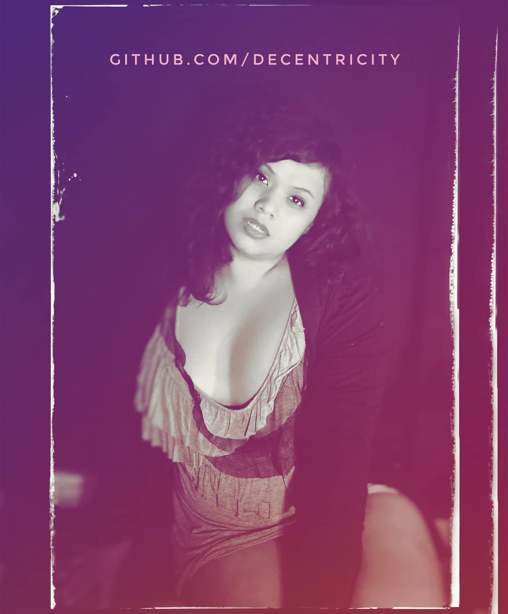

### Hi there 👋 Your friendly Blockchain girl here.

 
<!--
**Decentricity/Decentricity** is a ✨ _special_ ✨ repository because its `README.md` (this file) appears on your GitHub profile.
-->
I was born in 1984 so I'm extremely leery of government overreach and faceless megacorporations. This is reflected in the stuff that I do.

- 🔭 I’m currently working on [the DeBio Network](http://degenics.com) ([Github here](http://github.com/debionetwork)), which combines a privacy-first Blockchain with Bioinformatics.
- 🏙 I am making a metaverse-as-a-service company called [Reality Chain](https://realitychain.io)  ([Github of demo app here](http://github.com/2dcity)). This little metaverse won the #NEARProtocol #METABuidl Hackathon!
- 🐼 I have a website, [Decentri.city](http://decentri.city), where I review decentralized and self hosted technologies you can use today. I am migrating it to [decentricity.github.io](http://decentricity.github.io) since it's ironic that the current site is on Google Sites 😂
- ❤️ I used to have several bots on Twitter and Facebook. Due to strange policies they put in place during the 2018 mid-terms and 2020 elections, all my bots were removed. This github backs them up in several repositories. If you speak Indonesian, check out [robotpuisi.github.io](http://robotpuisi.github.io), which was probably my most successful bot. It actually had several articles written about it. If you don't speak Indonesian, you can go to that page anyway since it actually has a Google Translate mode, or go to its English-speaking sisters: 
    * [Future Dictionary Bot](http://robotpuisi.github.io/dict/index.html) 
    * [Startups Bot](http://robotpuisi.github.io/startups/index.html)
- 🌱 I’m currently working at [Blocksphere](http://blocksphere.id) and [Asosiasi Blockchain Indonesia](http://asosiasiblockchain.co.id). I also cofounded [Blockchain Zoo](http://blockchainzoo.com)
- 👯 I’m currently learning Genomic Data Science and Bioinformatics.
- 🤔 I’m looking for help to make [DeBio](http://degenics.com) real.
- 💬 Ask me about Blockchain. I'm primarily an Enterprise Blockchain consultant and I've consulted for multiple govt-owned entities, private banks, and startups. No repositories here since my consulting work are mostly propreitary. I did make a Telegram / Whatsapp chatbot that puts any text you shoot at it into a Blockchain for safekeeping, [TrustPanda](http://github.com/Decentricity/TrustPanda).
- 🏫 At school, I studied environmental engineering with a focus on both microbiology and environmental informatics. My final project back in 2008 was to create an Expert System (with Visual Prolog) for Environmental Impact Analysis -- basically an A.I. that helped you write an environmental impact report.
- 🅱️ Programming languages: Prolog, Python, Delphi/Pascal/Embarcadero, JavaScript
- 🌱 Low code: MIT App Inventor 2, Kodular, NodeRED
- 📫 How to reach me: [Linkedin](http://linkedin.com/in/wpandu) for the professional posts, [Twitter](https://twitter.com/decentricity) for the Degen stuff, [Instagram](http://instagram.com/decentricity) for the narcissistic selfies.
- 😄 Politics: Libertarian, Economic Conservative, Social Center-Left.
- ⚡ Articles by me or about me at [articles.md](articles.md)

(The repositories here are new on Github but are not **new**. They were either self-hosted on my own git, or behind the walled gardens of IBM Cloud.)
